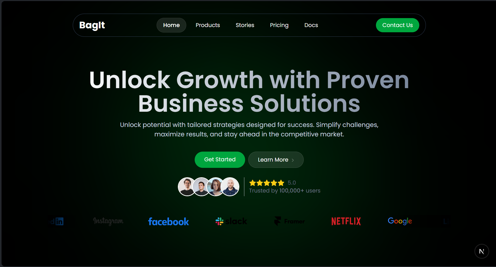

# BagIt - FullStack Admin Application




npx create-next-app@latest rn-shop-admin --typescript --tailwind --eslint --> for project setup
npx shadcn-ui@latest init --> shadcn setup

### ✅ Recommended Ways to Install Supabase CLI
#### Option 1 — Use npx (quickest & works everywhere)

- You don’t need to install anything globally. Just run:
```
npx supabase logout
```

or for any command:

```
npx supabase start
npx supabase login
npx supabase link
```
- To Regenerate the Types from the supabase
```
npx supabase gen types typescript --project-id ryitwsehcqgizpxbnzsq --schema public > src/supabase/types.ts
```

This will automatically fetch the latest Supabase CLI version.

### To declare the types in Supabase for Database
```
npx supabase gen types typescript --project-id ryitwsehcqgizpxbnzsq<this is project id> > src/supabase/types.ts<types that should fetch to this file>
```

## TechStack
1. NextJS
2. TypeScript
3. Supabase
4. Shadcn UI for prebuilt Snippets
5. Stripe - For Payment.

## Admin Panel For React Native Application in NextJS
- Bootstrap NextJS Application with Typescript 
- Master Routing in NextJS
- Supabase, Server Side Rending and Supabase Types
- Supabase Email and Password Authentication
- Authorization and Routes Protection in NextJS
- Role Level Security / Authorization
- Layout in NextJS
- Signout And Theming
- Category Table Supabase
- Fetch Category Server Action
- Product Schema and Row Level Security
- Category Page Setup
- Code walkthrough
- Category Page UI Implementation
- Category Page UI Completion
- Create Category And Supabase Storage
- Update And Delete Category
- Product Page Setup
- Code walkthrough
- Create product Schema
- Product CRUD actions
- Product Page Utility Setup
- Product Page Layout
- Project Walkthrough So Far